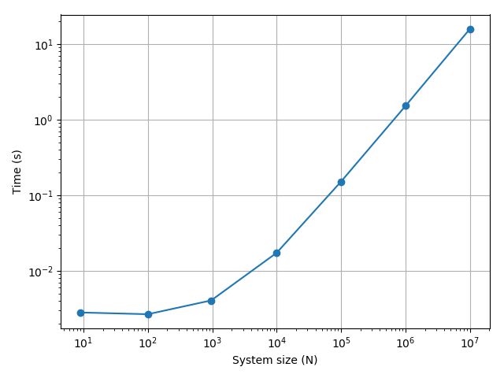

# lattpy

NOTE: This project is still under development and may change significantly!

`lattpy` is a python package for modeling bravais lattices and constructing (finite) lattice structures.

Installation
------------

Download package and install via pip
````commandline
pip install -e <folder path>
````
or the setup.py script
````commandline
python setup.py install
````


Usage
=====

Before accessing the attributes of the `Lattice`-model the lattice has to be configured

Configuration
-------------

A new instance of a lattice model is initialized using the unit-vectors of the Bravais lattice.
After the initialization the atoms of the unit-cell need to be added. To finish the configuration
the number of distances in the lattice need to be set. This computes the nearest distances between
all atoms of the unit-cells. If only the nearest distance is computed the lattice will be set to 
nearest neighbours.
````python
import numpy as np
from lattpy import Lattice

latt = Lattice(np.eye(2))       # Construct a Bravais lattice with square unit-vectors
latt.add_atom(pos=[0.0, 0.0])   # Add an Atom to the unit cell of the lattice
latt.set_num_neighbours(1)      # Set the maximum number of distances in the configuration.
````

To speed up the configuration prefabs of common lattices are included. The previous lattice 
can also be created with
````python
from lattpy import simple_square

latt = simple_square(a=1.0, neighbours=1)  # Initializes a square lattice with one atom in the unit-cell
````

So far only the lattice structure has been configured. To actually construct a (finite) model of the lattice
the model has to be built:
````python
latt.build(shape=(5, 3))
````
This will compute the indices and neighbours of all sites in the given shape and store the data.

After building the lattice periodic boundary conditions can be set along one or multiple axes:
````python
latt.set_periodic(axis=0)
````

To view the built lattice the `plot`-method can be used:
````python
from lattpy import simple_square

latt = simple_square(a=1.0, neighbours=1)
latt.build((5, 3), periodic=0)
latt.plot()
````


General lattice attributes
--------------------------

After configuring the lattice the attributes are available. 
Even without building a (finite) lattice structure all attributes can be computed on the fly for a given lattice vector, 
consisting of the translation vector `n` and the atom index `alpha`. For computing the (translated) atom positions 
the `get_position` method is used. Also, the neighbours and the vectors to these neighbours can be calculated. 
The `dist_idx`-parameter specifies the distance of the neighbours (0 for nearest neighbours, 1 for next nearest neighbours, ...):
````python
from lattpy import simple_square

latt = simple_square() 

# Get position of atom alpha=0 in the translated unit-cell
positions = latt.get_position(n=[0, 0], alpha=0)

# Get lattice-indices of the nearest neighbours of atom alpha=0 in the translated unit-cell
neighbour_indices = latt.get_neighbours(n=[0, 0], alpha=0, distidx=0)

# Get vectors to the nearest neighbours of atom alpha=0 in the translated unit-cell  
neighbour_vectors = latt.get_neighbour_vectors(alpha=0, distidx=0)
```` 

Also, the reciprocal lattice vectors can be computed
````python
rvecs = latt.reciprocal_vectors()
````

or used to construct the reciprocal lattice:
````python
rlatt = latt.reciprocal_lattice()
````

The 1. Brillouin zone is the Wigner-Seitz cell of the reciprocal lattice:
````python
bz = rlatt.wigner_seitz_cell()
````

The 1.BZ can also be obtained by calling the explicit method of the direct lattice:
````python
bz = latt.brillouin_zone()
````


Finite lattice data
-------------------

If the lattice has been built the needed data is cached. The lattice sites of the 
structure then can be accessed by a simple index `i`. The syntax is the same as before, 
just without the `get_` prefix:

````python
from lattpy import simple_square

latt = simple_square()
latt.build((5, 2))
idx = 2

# Get position of the atom with index i=2
positions = latt.position(idx)

# Get the atom indices of the nearest neighbours of the atom with index i=2
neighbour_indices = latt.neighbours(idx, distidx=0)

# the nearest neighbours can also be found by calling (equivalent to dist_idx=0)
neighbour_indices = latt.nearest_neighbours(idx)

````

Performance
===========

Even though `lattpy` is written in pure python, it achieves high performance and 
a low memory footprint by making heavy use of numpy's vectorized operations. 
As an example the build-times of a square lattice for different number of sites 
are shown in the following plot:



Note that the overhead of the multi-thread neighbour search results in a slight 
increase of the build time for small systems. By using `num_jobs=1` in the `build`-method
this overhead can be eliminated for small systems. By passing `num_jobs=-1` all cores
of the system is used.


Examples
========

Using the (built) lattice model it is easy to construct the (tight-binding) 
Hamiltonian of a non-interacting model:

````python
import numpy as np
from lattpy import simple_chain

# Initializes a 1D lattice chain with a length of 5 atoms.
latt = simple_chain(a=1.0)
latt.build(shape=4)
n = latt.num_sites

# Construct the non-interacting (kinetic) Hamiltonian-matrix
eps, t = 0., 1.
ham = np.zeros((n, n))
for i in range(n):
    ham[i, i] = eps
    for j in latt.nearest_neighbours(i):
        ham[i, j] = t
````


Since we loop over all sites of the lattice the construction of the hamiltonian is slow. 
An alternative way of mapping the lattice data to the hamiltonian is using the `DataMap`
object returned by the `map()` method of the lattice data. This stores the atom-types, 
neighbour-pairs and corresponding distances of the lattice sites. Using the built-in 
masks the construction of the hamiltonian-data can be vectorized:
````python
import numpy as np
from scipy import sparse
from lattpy import simple_chain

# Initializes a 1D lattice chain with a length of 5 atoms.
latt = simple_chain(a=1.0)
latt.build(shape=4)
n = latt.num_sites

# Vectorized construction of the hamiltonian
eps, t = 0., 1.

dmap = latt.data.map()               # Build datamap
values = np.zeros(dmap.size)         # Initialize array for data of H
values[dmap.onsite(alpha=0)] = eps   # Map onsite-energies to the array
values[dmap.hopping(distidx=0)] = t  # Map hopping-energies to array

# The indices and data array can be used to construct a sparse matrix 
ham_s = sparse.csr_matrix((values, dmap.indices))
ham = ham_s.toarray()
````

Both construction methods will create the following Hamiltonian-matrix:
````
[[0. 1. 0. 0. 0.]
 [1. 0. 1. 0. 0.]
 [0. 1. 0. 1. 0.]
 [0. 0. 1. 0. 1.]
 [0. 0. 0. 1. 0.]]
````

If periodic boundary conditions are set (along axis 0) the output is:
````
[[0. 1. 0. 0. 1.]
 [1. 0. 1. 0. 0.]
 [0. 1. 0. 1. 0.]
 [0. 0. 1. 0. 1.]
 [1. 0. 0. 1. 0.]]
````