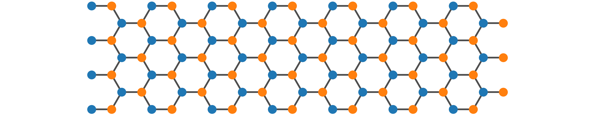

.. lattpy documentation master file, created by
   sphinx-quickstart on Mon Jan 31 12:11:09 2022.
   You can adapt this file completely to your liking, but it should at least
   contain the root `toctree` directive.

===============================================
Simple and Efficient Lattice Modeling in Python
===============================================

|pypi-python-version| |pypi-version| |pypi-status| |pypi-license| |lgtm-grade| |style-black|

    “Any dimension and shape you like.”

*LattPy* is a simple and efficient Python package for modeling Bravais lattices and
constructing (finite) lattice structures in any dimension.
It provides an easy interface for constructing lattice structures by simplifying the
configuration of the unit cell and the neighbor connections - making it possible to
construct complex models in just a few lines of code and without the headache of
adding neighbor connections manually. You will save time and mental energy for more important matters.

+---------+---------------+-----------------+---------------+
| Master  ||tests-master| ||codecov-master| | |docs-master| |
+---------+---------------+-----------------+---------------+
| Dev     ||tests-dev|    ||codecov-dev|    | |docs-dev|    |
+---------+---------------+-----------------+---------------+

.. warning::
   This project is still in development and might change significantly in the future!

.. toctree::
   :maxdepth: 3
   :caption: User Guide

   installation
   quickstart
   tutorial/index

.. toctree::
   :maxdepth: 1
   :titlesonly:
   :caption: API Reference

   lattpy
   generated/lattpy.atom
   generated/lattpy.basis
   generated/lattpy.data
   generated/lattpy.disptools
   generated/lattpy.lattice
   generated/lattpy.plotting
   generated/lattpy.shape
   generated/lattpy.spatial
   generated/lattpy.structure
   generated/lattpy.utils

.. toctree::
   :maxdepth: 3
   :caption: Development

   development/changes
   development/contributing

Indices and tables
==================

* :ref:`genindex`
* :ref:`modindex`
* :ref:`search`

.. |pypi-python-version| image:: https://img.shields.io/pypi/pyversions/lattpy?logo=python&style=flat-square
   :alt: PyPI - Python Version
   :target: https://pypi.org/project/lattpy/
.. |pypi-version| image:: https://img.shields.io/pypi/v/lattpy?logo=pypi&style=flat-square
   :alt: PyPI - Version
   :target: https://pypi.org/project/lattpy/
.. |pypi-status| image:: https://img.shields.io/pypi/status/lattpy?color=yellow&style=flat-square
   :alt: PyPI - Status
   :target: https://pypi.org/project/lattpy/
.. |pypi-license| image:: https://img.shields.io/pypi/l/lattpy?style=flat-square
   :alt: PyPI - License
   :target: https://github.com/dylanljones/lattpy/blob/master/LICENSE
.. |lgtm-grade| image:: https://img.shields.io/lgtm/grade/python/github/dylanljones/lattpy?label=code%20quality&logo=lgtm&style=flat-square
   :alt: LGTM Grade
   :target: https://lgtm.com/projects/g/dylanljones/lattpy/context:python
.. |style-black| image:: https://img.shields.io/badge/code%20style-black-000000.svg?style=flat-square
   :alt: Code style: black
   :target: https://github.com/psf/black

.. |tests-master| image:: https://img.shields.io/github/workflow/status/dylanljones/lattpy/Test/master?label=tests&logo=github&style=flat
   :alt: Test status master
   :target: https://github.com/dylanljones/lattpy/actions/workflows/test.yml
.. |tests-dev| image:: https://img.shields.io/github/workflow/status/dylanljones/lattpy/Test/dev?label=tests&logo=github&style=flat
   :alt: Test status dev
   :target: https://github.com/dylanljones/lattpy/actions/workflows/test.yml
.. |codecov-master| image:: https://codecov.io/gh/dylanljones/lattpy/branch/master/graph/badge.svg?token=P61R3IQKXC
   :alt: Coverage master
   :target: https://app.codecov.io/gh/dylanljones/lattpy/branch/master
.. |codecov-dev| image:: https://codecov.io/gh/dylanljones/lattpy/branch/dev/graph/badge.svg?token=P61R3IQKXC
   :alt: Coverage dev
   :target: https://app.codecov.io/gh/dylanljones/lattpy/branch/dev
.. |docs-master| image:: https://img.shields.io/readthedocs/lattpy/latest?style=flat
   :alt: Docs master
   :target: https://lattpy.readthedocs.io/en/latest/
.. |docs-dev| image:: https://img.shields.io/readthedocs/lattpy/dev?style=flat
   :alt: Docs dev
   :target: https://lattpy.readthedocs.io/en/dev/
